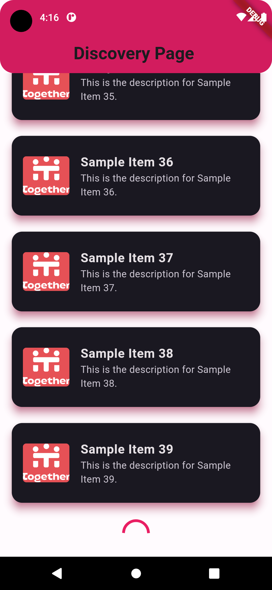
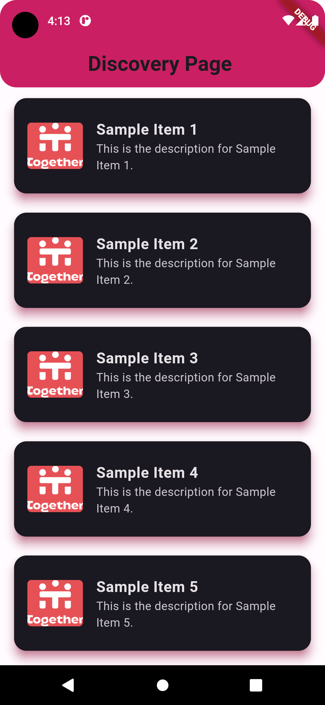
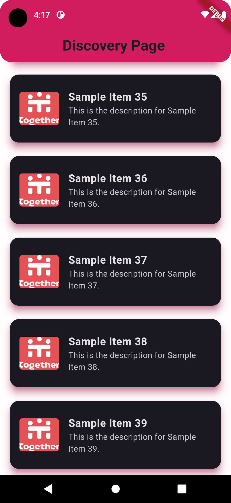
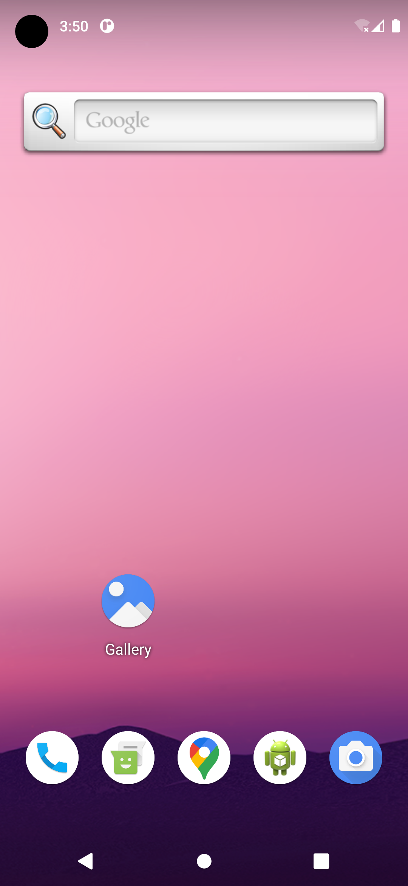

# Flutter Discovery App

Welcome to the Flutter Discovery App! This app allows users to explore a variety of items fetched from a mock API, with smooth infinite scroll pagination and a visually appealing interface.






## Features

- *Discovery Page*: Browse through a curated list of items fetched from the mock API.
- *Infinite Scroll Pagination*: Load more items seamlessly as you scroll down the page.
- *Visually Appealing UI*: Enjoy a visually pleasing interface with smooth animations and transitions.
- *Custom Theme*: Pink and black color combination for a stylish look.

## Getting Started

To run this Flutter app locally, follow these steps:

1. Clone this repository to your local machine:

   ```bash
   git clone <repository_url>


2. Navigate to the project directory:
    ```bash
    cd flutter-discovery-app

3. Install dependencies using Flutter's package manager, pub:
    ```bash
    flutter pub get

4. Run the app on a connected device or emulator:
    ```bash
    flutter run

##Dependencies

This project uses the following dependencies:

http: For making HTTP requests to fetch data from the mock API.
flutter/material.dart: Flutter's material design widgets for building the UI.
dart:convert: Dart's built-in library for encoding and decoding JSON data.